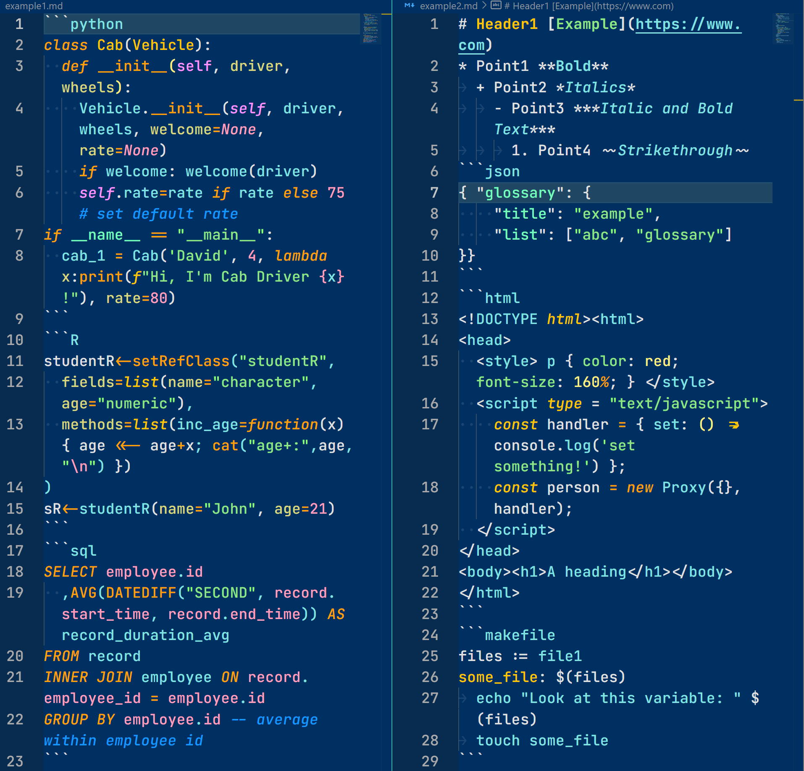
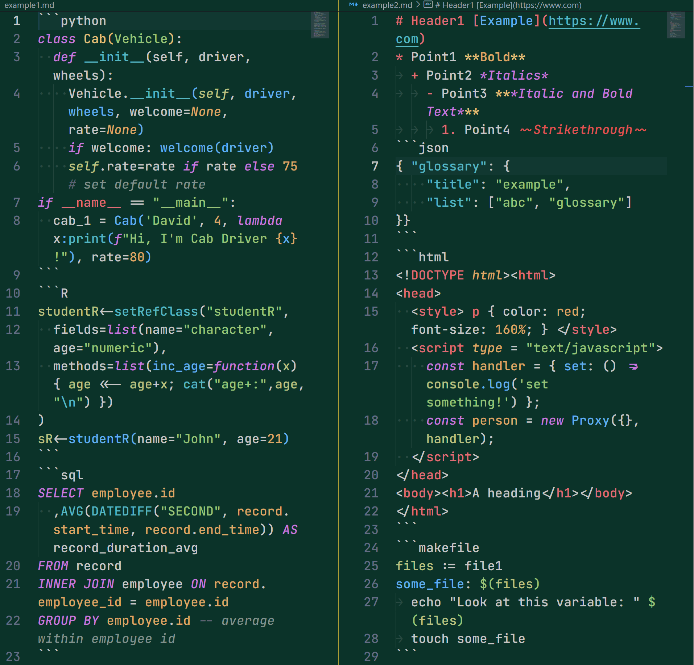

# README

2020-12-06 Here are 3 color themes that are customized to my taste. Screenshots are taken with R and Python as I have been working with them the most.

*Rui Cobalt* was derived from the [Cobalt2](https://github.com/wesbos/cobalt2-vscode) theme.

*Rui Emerald* and *Rui Topaz* were derived from the [Yi Dark & Light Themes](https://github.com/wangweixuan/yithemes) theme.

